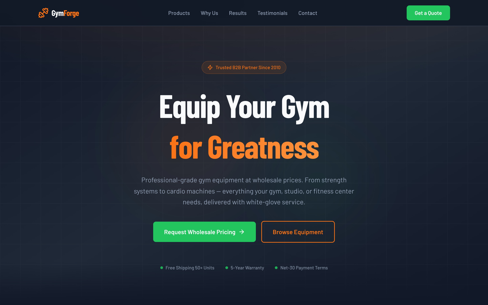
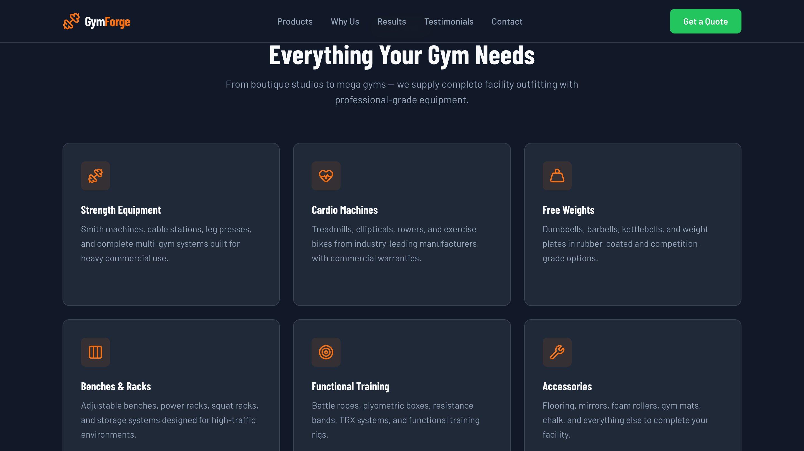
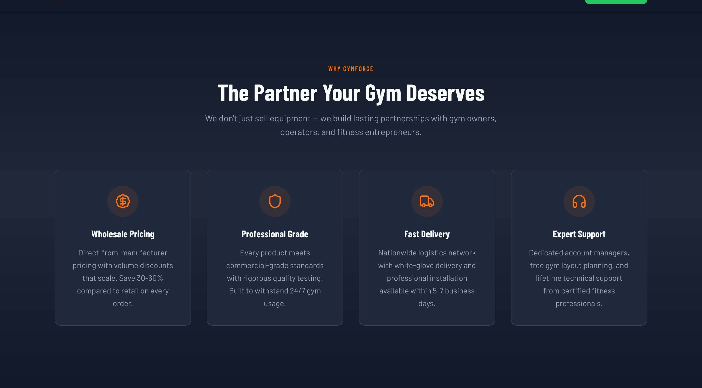
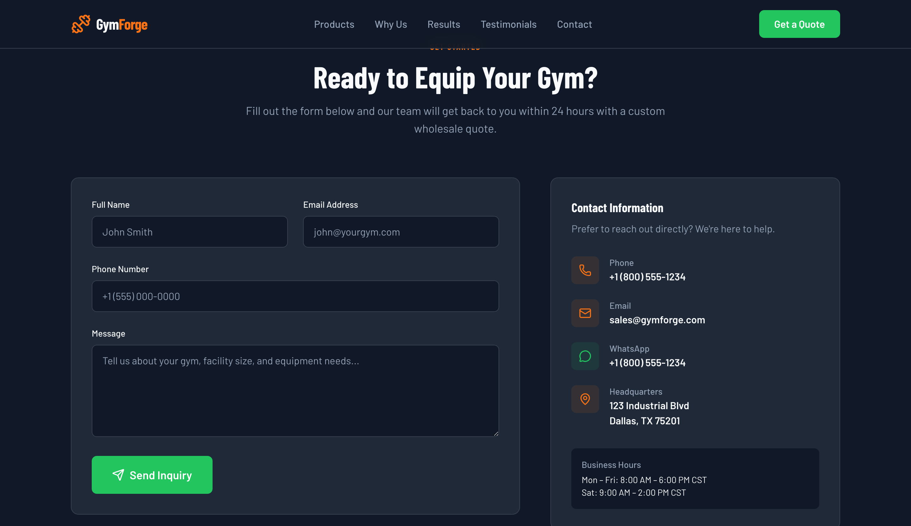
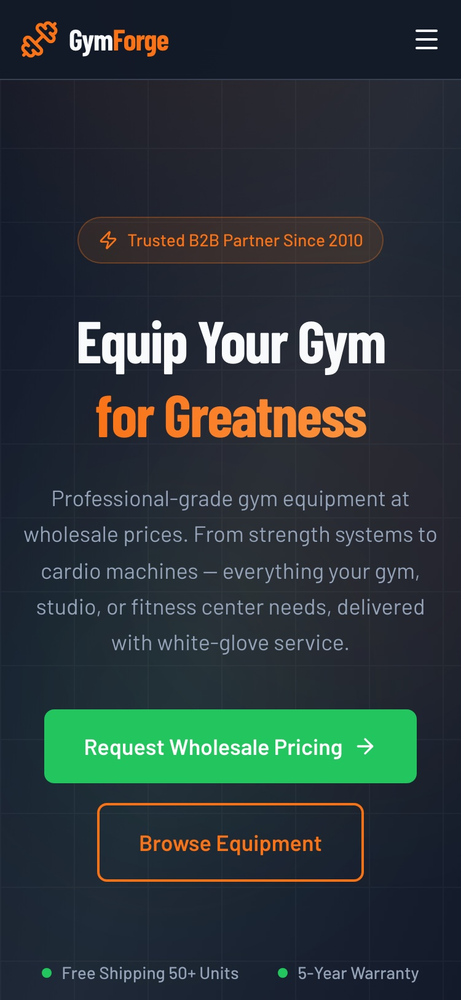

# GymForge — Professional Gym Equipment B2B Landing Page

A production-quality one-page landing page for a B2B gym equipment wholesale retailer.


## 📸 Preview

### Desktop









### Mobile

<p align="center">
  
</p>

## Tech Stack

- **Framework:** Next.js 15 (App Router, static export)
- **Styling:** Tailwind CSS v4
- **Language:** TypeScript
- **Icons:** Lucide React
- **Fonts:** Barlow Condensed + Barlow (Google Fonts)

## Features

- Dark, premium design with bold typography
- Fully responsive (375px → 1440px)
- Animated counter stats with Intersection Observer
- Smooth scroll navigation
- Accessible: keyboard navigation, focus states, `prefers-reduced-motion`
- SEO-optimized with Open Graph meta tags
- Client-side contact form with validation
- Static export — deploy anywhere

## Sections

1. **Navbar** — Sticky navigation with mobile hamburger menu
2. **Hero** — Full-viewport with gradient backgrounds and CTA
3. **Product Categories** — 6-card grid with hover effects
4. **Why Choose Us** — 4 USPs with icon animations
5. **Stats** — Animated counters (scroll-triggered)
6. **Testimonials** — 3 customer testimonial cards
7. **Contact** — Form + contact info sidebar
8. **Footer** — Links, social icons, copyright

## Getting Started

```bash
npm install
npm run dev
```

Open [http://localhost:3000](http://localhost:3000).

## Build

```bash
npm run build
```

Static output is generated in the `out/` directory.

## Design System

See [`_briefs/MASTER.md`](./_briefs/MASTER.md) for the full design system specification.

## License

MIT
